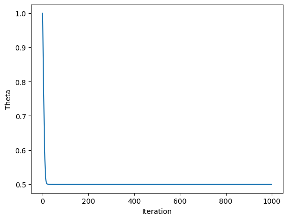

# Statistical Inference Project 1

## Question 1(a)

- Aim:- Device an algorithm using inverse transformation technique to generate random number from the above probability density function.

According to inverse algorithm we need to find cumulative distribution function (CDF) for the given PDF.

```math
    \begin{align*}
        & F(x)= \int_{0}^{x} (2u+1)e^{-(u^2+u)}du \\
        & \text{using \quad}t = u^2+u, \quad dt = 2udu +du = (2u+1)du \\
        & F(x)= \int_{0}^{x} e^{-t}dt \\
        & F(x)= [-e^t]_0^x\\
        & F(x)= 1-e^{-(x^2+x)} \\
    \end{align*}
```

cumulative distribution function (CDF) for the given PDF:

```math
    \begin{align*}
        & F(x)=\begin{cases}
            1-e^{-(x^2+x)} & x> 0\\
            0 & otherwise\\
            \end{cases}\\
    \end{align*}
```

Finding quasi-inverse of F:-

```math
    \begin{align*}
        & F(x)= 1-e^{-(x^2+x)} \\
        & e^{-(x^2+x)} = 1- F(x) \\
        \text{taking log both sides}\\
        & -(x^2+x) = ln(1-F(x)) \\
        & (x^2+x) + ln(1-F(x)) = 0 \\
        \text{solving for x}\\
        &x = \frac{-1\pm \sqrt{1-4ln(1-F(x))}}{2}\\
        &x = \frac{-1}{2} \pm \sqrt{\frac{1}{4}-ln(1-F(x))}\\
        \text{as x > 0}\\
        &x = \frac{-1}{2} + \sqrt{\frac{1}{4}-ln(1-F(x))}\\            
    \end{align*}
```

Now according to the inverse algorithm, making

```math
    \begin{align*}
        
        &F^{-1}(U) = \frac{-1}{2} + \sqrt{\frac{1}{4}-ln(1-U)}\\
        \text{replacing 1-U with U}\\ 
        &F^{-1}(U) = \frac{-1}{2} + \sqrt{\frac{1}{4}-ln(U)}\\           
    \end{align*}
```

Algorithm is given by:

```math
    \begin{align*}
& \text{1. Generate U from U(0, 1) distribution.}\\
& 2.\quad X = \frac{-1}{2} + \sqrt{\frac{1}{4}-ln(U)}\\
& \text{3. Return X}\\
    \end{align*}
```

## Question 1(b)

- Aim:- Obtain an estimate of the expectation corresponding to the above probability density function using Monte Carlo technique. Mention each step in the report including the value of seed and the number of random numbers used in this calculation.

In a simple Monte Carlo problem, we express the quantity we want to know as the expected value of a random variable Y, such as ```µ = E(Y)```.
Generate values ```Y1, . . . , Yn``` independently from the distribution of Y.
Take their average

```math
\begin{align*}
& \hat{\mu_{n}} = \frac{1}{n}\sum_{i=1}^{n}Y_i
\end{align*}
```

as an estimate of µ.

In this case we take random sample of size ```10,0000``` using the seed number ```42```.
which can be done by generating 10,000 random numbers from U(0, 1) and the using X from part(a) converting it into given pdf distribtution.
Then taking average of these random sample (X) we find estimator for expected value.
which comes as ```0.5456065888744848```.
To verify this estimator we use technology to integrate xf(x) which is approximately ```µ = 0.5456```.

## Question 1(c)

Again using the same seed that we used in part(b) ```42``` .
This time we are generating 10,000 with same procedure.
Using the graph we can see that histogram of generated random number is following the same distribution of the given pdf. which is obvious and also this verifing our algorithm.


## Question 2(a)

Given CDF:

```math
    \begin{align*}
        & F(x)=\begin{cases}
            \left(1-e^{-\frac{x}{\theta}}\right)^2 & x> 0\\
            0 & x\leq0\\
            \end{cases}\\
    \end{align*}
```

Evaluating Probability distribution function (PDF) by differentiating given CDF:

```math
    \begin{align*}
        & f(x|\theta)=\frac{d}{dx}F(x|\theta)\\
        & f(x|\theta)=\frac{d}{dx}\left(1-e^{-\frac{x}{\theta}}\right)^2\\
        & f(x|\theta)=2\left(1-e^{-\frac{x}{\theta}}\right)\frac{d}{dx}\left(1-e^{-\frac{x}{\theta}}\right)\\
        & f(x|\theta)=2\left(1-e^{-\frac{x}{\theta}}\right)\left(\frac{1}{\theta}e^{-\frac{x}{\theta}}\right)\\
        & f(x|\theta)=\frac{2}{\theta}\left(1-e^{-\frac{x}{\theta}}\right)e^{-\frac{x}{\theta}}\\
    \end{align*}
```

Hence the probability density function is given by:

```math
    \begin{align*}
        &f(x|\theta) = \begin{cases} 
          \frac{2}{\theta}\left(1-e^{-\frac{x}{\theta}}\right)e^{-\frac{x}{\theta}} & x\geq 0 \\
          0 & otherwise 
       \end{cases}
    \end{align*}
```

Now we can define the likelihood function as follows:

```math
    \begin{align*}
        & L(\theta)=\prod_{i=1}^{53}f(x_i|\theta)\\
        & L(\theta)=\prod_{i=1}^{53}\frac{2}{\theta}\left(1-e^{-\frac{x_i}{\theta}}\right)e^{-\frac{x_i}{\theta}}\\
        & L(\theta)=\left(\frac{2}{\theta}\right)^{53}\prod_{i=1}^{53}\left(1-e^{-\frac{x_i}{\theta}}\right)e^{-\frac{x_i}{\theta}}\\
    \end{align*}
```

The likelihood function is given by:

```math
\begin{align*}
        & F(x)=\begin{cases}
           L(\theta)=\left(\frac{2}{\theta}\right)^{53}\prod_{i=1}^{53}\left(1-e^{-\frac{x_i}{\theta}}\right)e^{-\frac{x_i}{\theta}}  & x_{i} \geq 0\\
            0 & otherwise\\
            \end{cases}\\
    \end{align*}
```

Taking log-likelihood to make it more suitable to find MLE:

```math
    \begin{align*}
        & ln(L(\theta))=53ln\left(\frac{2}{\theta}\right)+\sum_{i=1}^{53}ln\left(1-e^{-\frac{x_i}{\theta}}\right)-\sum_{i=1}^{53}\frac{x_i}{\theta}\\
        &\tag{1} ln(L(\theta))=53ln(2)-53ln(\theta)+\sum_{i=1}^{53}ln\left(1-e^{-\frac{x_i}{\theta}}\right)-\sum_{i=1}^{53}\frac{x_i}{\theta}\\
    \end{align*}
```

To find the MLE, we have to maximize likelihood function which is equivalent to maximum log-likelihood function as log is increasing function.
Now, to maximum log-likelihood we use derivative test:

First we evaluate derivative of log-likelihood function to find critical points making it equal to 0:

```math
    \begin{align*}
        & \frac{d}{d\theta}ln(L(\theta))=0\\
        & \frac{d}{d\theta}\left(53ln(2)-53ln(\theta)+\sum_{i=1}^{53}ln\left(1-e^{-\frac{x_i}{\theta}}\right)-\sum_{i=1}^{53}\frac{x_i}{\theta}\right)=0\\
        & -\frac{53}{\theta}-\sum_{i=1}^{53}\frac{e^{-\frac{x_i}{\theta}}x_i}{\theta^2(1-e^{-\frac{x_i}{\theta}})}+\sum_{i=1}^{53}\frac{x_i}{\theta^2}=0\\
       
       
    \end{align*}
```

here we can clearly see that the above equation is not solvable analytically, so we will use numerical methods to find the MLE. We will use the gradient descent method to find the MLE. The gradient descent method is an iterative method to find the minimum of a function. The algorithm is as follows:

1. Initialize the value of $\theta$
2. Calculate the gradient of the function at the current value of $\theta$
3. Update the value of  $\theta$ using the formula:

```math
\theta_{new}=\theta_{old}-\alpha\frac{d}{d\theta}ln(L(\theta))
```

where $\alpha$ is the learning rate.

4. Repeat steps 2 and 3 until the value of $\theta$ converges.

We will use the following values for the parameters:

1. Initial value of $\theta$: 1
2. Learning rate: 0.001
We will use the following stopping criteria:
1. 1000 iterations
since our problem is of maximization, we can convert it into a minimization problem by multiplying it by -1. we also have one constant term in the equation (1) i.e 53ln2. which can be discarded because it won't affect the optimum solution. So our final equation for minimization is:

```math
    \begin{align*}
        &\tag{2} -ln(L(\theta))=-\sum_{i=1}^{53}ln\left(1-e^{-\frac{x_i}{\theta}}\right)+\sum_{i=1}^{53}\frac{x_i}{\theta}+53ln(\theta)\\
        &\frac{d}{d\theta}ln(-L(\theta))=\frac{1}{\theta^2}\left({53\theta}+\sum_{i=1}^{53}\frac{e^{-\frac{x_i}{\theta}}x_i}{(1-e^{-\frac{x_i}{\theta}})}-\sum_{i=1}^{53}{x_i}\right)\\
    \end{align*}
```

using the above equation with specified parameters, we have found that the MLE is converging to 0.5 as we can see in the below graph:


## Question 2(b)

According to the given question we want to estimate the bias and mean squared error of the MLE of $\theta$ = 0.5, 1,2 using Monte-Carlo method. The bias and mean squared error are defined as follows:

```math
    \begin{align*}
        & \text{Bias}(\hat{\theta})=E(\hat{\theta})-\theta\\
        & \text{Mean Squared Error}(\hat{\theta})=E((\hat{\theta}-\theta)^2)\\
    \end{align*}
```

where $\hat{\theta}$ is the MLE of $\theta$ and $\theta$ is the true value of $\theta$. We will use the following steps to estimate the bias and mean squared error:

1. Generate 100 random samples from the given distribution with $\theta$ = 0.5, 1, 2. We will use the inverse transform method to generate the random samples.

```math
    \begin{align*}
        & \text{The inverse transform method is used to generate random samples from a given distribution.}\\
        & \text{The algorithm is as follows:}\\
        & \text{1. Generate a random number $U$ from the uniform distribution on the interval [0,1].}\\
        & \text{2. Calculate the inverse of the CDF at the value of $U$ to get the random sample.}\\
        & \text{We will use the following CDF to generate the random samples:}\\
        & F(x)=\begin{cases}
            \left(1-e^{-\frac{x}{\theta}}\right)^2 & x> 0\\
            0 & x\leq0\\
            \end{cases}\\
        & \text{The inverse of the CDF is given by:}\\
        & F(x)=\left(1-e^{-\frac{x}{\theta}}\right)^2\\
        & \sqrt{F(x)}=1-e^{-\frac{x}{\theta}}\\
        & e^{-\frac{x}{\theta}}=1-\sqrt{F(x)}\\
        & -\frac{x}{\theta}=ln(1-\sqrt{F(x)})\\
        & x=-\theta ln(1-\sqrt{F(x)})\\
        & \text{We will use the above equation to generate the random samples.}\\
    \end{align*}
```

2. Calculate the MLE of $\theta$ for each sample by using the method described in Question2(a).
3. Repeat the above steps 1 and 2 for 100 times to get 100 MLEs for each value of $\theta$. Here iteration number is used as seed for random number generation.
4. Calculate the bias and mean squared error of the MLE for each value of $\theta$ using the following formulas:

```math
    \begin{align*}
        & \text{Bias}(\hat{\theta})=E(\hat{\theta})-\theta\\
        & \text{Mean Squared Error}(\hat{\theta})=E((\hat{\theta}-\theta)^2)\\
    \end{align*}
```

by performing this experiment we the following results $\rightarrow$

1. $\theta$=0.5, mse=0.0011625406930615128, bias=-0.004914924669973003
2. $\theta$=1, mse=0.0046501627722460625, bias=-0.00982984933994567
3. $\theta$=2, mse=0.01860065108898442, bias=-0.019659698679888572
